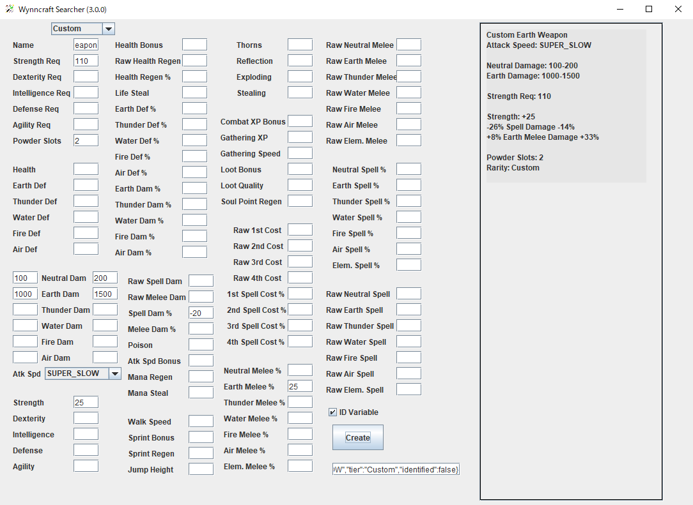

# WynnSearcher
Can Easy Search Wynncraft Item and Ingredients

## Requirement
Java 8 or above  
Gson (Include)

## How to Use
### Searcher

### Builder (Beta)
Can Use Warrior Only (Other Ability Tree is Creating...)

### Crafter (Beta)

### Custom

## Sum Calc Info
Total Health = Health + Health Bonus  
Total Health Regen = Raw Health Regen * (100 + Health Regen % / 100)  
Raw Defenses = Raw Earth Def + Raw Thunder Def + Raw Water Def + Raw Fire Def + Raw Air Def  
Raw Rainbow Defenses = Raw Defenses (Need All)  
Defenses % = Earth Def % + Thunder Def % + Water Def % + Fire Def % + Air Def %  
Rainbow Defenses % = Defenses % (Need All)  
Skill Point Bonus = Strength + Dexterity + Intelligence + Defence + Agility  
Rainbow Skill Point Bonus = Skill Point Bonus (Need All)  
  
Base DPS = Neutral DPS + Earth DPS + Thunder DPS + Water DPS + Fire DPS + Air DPS   
Neutral DPS = (Neutral Damage Min + Neutral Damage Max) / 2 * Attack Speed  
Earth DPS = (Earth Damage Min + Earth Damage Max) / 2 * Attack Speed  
Thunder DPS = (Thunder Damage Min + Thunder Damage Max) / 2 * Attack Speed  
Water DPS = (Water Damage Min + Water Damage Max) / 2 * Attack Speed  
Fire DPS = (Fire Damage Min + Fire Damage Max) / 2 * Attack Speed  
Air DPS = (Air Damage Min + Air Damage Max) / 2 * Attack Speed  
  
Damages Raw = Neutral Damage Max + Earth Damage Max + Thunder Damage Max + Water Damage Max + Fire Damage Max + Air Damage Max  
Rainbow Damages Raw = Earth Damage Max + Thunder Damage Max + Water Damage Max + Fire Damage Max + Air Damage Max (Need All)  
Damages % = Earth Damage % + Thunder Damage % + Water Damage % + Fire Damage % + Air Damage %  
Rainbow Damages % = Damages % (Need All)  
  
Total Melee Damage = Total Neutral Melee Damage + Total Earth Melee Damage + Total Thunder Melee Damage + Total Water Melee Damage + Total Fire Melee Damage + Total Air Melee Damage - Raw Melee Damage * 5 - (Raw Elemental Melee Damage + Raw Elemental Damage) * 4  
Total Neutral Melee Damage = Neutral Damage Max * (1 + (Melee Damage % + Neutral Melee Damage %) / 100) + Raw Neutral Melee Damage + Raw Melee Damage  
Total Earth Melee Damage = Earth Damage Max * (1 + (Melee Damage % + Earth Melee Damage % + Elemental Melee Damage % + Elemental Damage %) / 100) + Raw Earth Melee Damage + Raw Melee Damage + Raw Elemental Melee Damage + Raw Elemental Damage  
Total Thunder Melee Damage = Thunder Damage Max * (1 + (Melee Damage % + Thunder Melee Damage % + Elemental Melee Damage % + Elemental Damage %) / 100) + Raw Thunder Melee Damage + Raw Melee Damage + Raw Elemental Melee Damage + Raw Elemental Damage  
Total Water Melee Damage = Water Damage Max * (1 + (Melee Damage % + Water Melee Damage % + Elemental Melee Damage % + Elemental Damage %) / 100) + Raw Water Melee Damage + Raw Melee Damage + Raw Elemental Melee Damage + Raw Elemental Damage  
Total Fire Melee Damage = Fire Damage Max * (1 + (Melee Damage % + Fire Melee Damage % + Elemental Melee Damage % + Elemental Damage %) / 100) + Raw Fire Melee Damage + Raw Melee Damage + Raw Elemental Melee Damage + Raw Elemental Damage  
Total Air Melee Damage = Air Damage Max * (1 + (Melee Damage % + Air Melee Damage % + Elemental Melee Damage % + Elemental Damage %) / 100) + Raw Air Melee Damage + Raw Melee Damage + Raw Elemental Melee Damage + Raw Elemental Damage  
  
Total Melee DPS = Total Neutral Melee DPS + Total Earth Melee DPS + Total Thunder Melee DPS + Total Water Melee DPS + Total Fire Melee DPS + Total Air Melee DPS - ((Raw Melee Damage * 5 + (Raw Elemental Melee Damage + Raw Elemental Damage) * 4) * Attack Speed)  
Total Neutral Melee DPS = ((Neutral Damage Min + Neutral Damage Max) / 2 * (1 + (Melee Damage % + Neutral Melee Damage %) / 100) + Raw Neutral Melee Damage + Raw Melee Damage) * Attack Speed  
Total Earth Melee DPS = ((Earth Damage Min + Earth Damage Max) / 2 * (1 + (Melee Damage % + Earth Melee Damage % + Elemental Melee Damage % + Elemental Damage %) / 100) + Raw Earth Melee Damage + Raw Melee Damage + Raw Elemental Melee Damage + Raw Elemental Damage) * Attack Speed  
Total Thunder Melee DPS = ((Thunder Damage Min + Thunder Damage Max) / 2 * (1 + (Melee Damage % + Thunder Melee Damage % + Elemental Melee Damage % + Elemental Damage %) / 100) + Raw Thunder Melee Damage + Raw Melee Damage + Raw Elemental Melee Damage + Raw Elemental Damage) * Attack Speed  
Total Water Melee DPS = ((Water Damage Min + Water Damage Max) / 2 * (1 + (Melee Damage % + Water Melee Damage % + Elemental Melee Damage % + Elemental Damage %) / 100) + Raw Water Melee Damage + Raw Melee Damage + Raw Elemental Melee Damage + Raw Elemental Damage) * Attack Speed  
Total Fire Melee DPS = ((Fire Damage Min + Fire Damage Max) / 2 * (1 + (Melee Damage % + Fire Melee Damage % + Elemental Melee Damage % + Elemental Damage %) / 100) + Raw Fire Melee Damage + Raw Melee Damage + Raw Elemental Melee Damage + Raw Elemental Damage) * Attack Speed  
Total Air Melee DPS = ((Air Damage Min + Air Damage Max) / 2 * (1 + (Melee Damage % + Air Melee Damage % + Elemental Melee Damage % + Elemental Damage %) / 100) + Raw Air Melee Damage + Raw Melee Damage + Raw Elemental Melee Damage + Raw Elemental Damage) * Attack Speed  
  
Total Spell DPS = Total Neutral Spell DPS + Total Earth Spell DPS + Total Thunder Spell DPS + Total Fire Spell DPS + Total Air Spell DPS - Raw Spell Damage * 5 - (Raw Elemental Spell Damage + Raw Elemental Damage) * 4  
Total Neutral Spell DPS = (Neutral Damage Min + Neutral Damage Max) / 2 * (1 + (Spell Damage % + Neutral Spell Damage %) / 100) * Attack Speed + Raw Neutral Spell Damage + Raw Spell Damage  
Total Earth Spell DPS = (Earth Damage Min + Earth Damage Max) / 2 * (1 + (Earth Spell Damage % + Spell Damage % + Elemental Spell Damage % + Raw Elemental Damage %) / 100) * Attack Speed + Raw Earth Spell Damage + Raw Elemental Spell Damage + Raw Spell Damage + Raw Elemental Damage  
Total Thunder Spell DPS = (Thunder Damage Min + Thunder Damage Max) / 2 * (1 + (Thunder Spell Damage % + Spell Damage % + Elemental Spell Damage % + Raw Elemental Damage %) / 100) * Attack Speed + Raw Thunder Spell Damage + Raw Elemental Spell Damage + Raw Spell Damage + Raw Elemental Damage  
Total Water Spell DPS = (Water Damage Min + Water Damage Max) / 2 * (1 + (Water Spell Damage % + Spell Damage % + Elemental Spell Damage % + Raw Elemental Damage %) / 100) * Attack Speed + Raw Water Spell Damage + Raw Elemental Spell Damage + Raw Spell Damage + Raw Elemental Damage  
Total Fire Spell DPS = (Fire Damage Min + Fire Damage Max) / 2 * (1 + (Fire Spell Damage % + Spell Damage % + Elemental Spell Damage % / + Raw Elemental Damage %) 100) * Attack Speed + Raw Fire Spell Damage + Raw Elemental Spell Damage + Raw Spell Damage + Raw Elemental Damage  
Total Air Spell DPS = (Air Damage Min + Air Damage Max) / 2 * (1 + (Air Spell Damage % + Spell Damage % + Elemental Spell Damage % + Raw Elemental Damage %) / 100) * Attack Speed + Raw Air Spell Damage + Raw Elemental Spell Damage + Raw Spell Damage + Raw Elemental Damage  
  
Raw Spell Costs = Raw 1st Spell Cost + Raw 2nd Spell Cost + Raw 3rd Spell Cost + Raw 4th Spell Cost  
Spell Costs % = 1st Spell Cost % + 2nd Spell Cost % + 3rd Spell Cost % + 4th Spell Cost %  

## Screenshots

