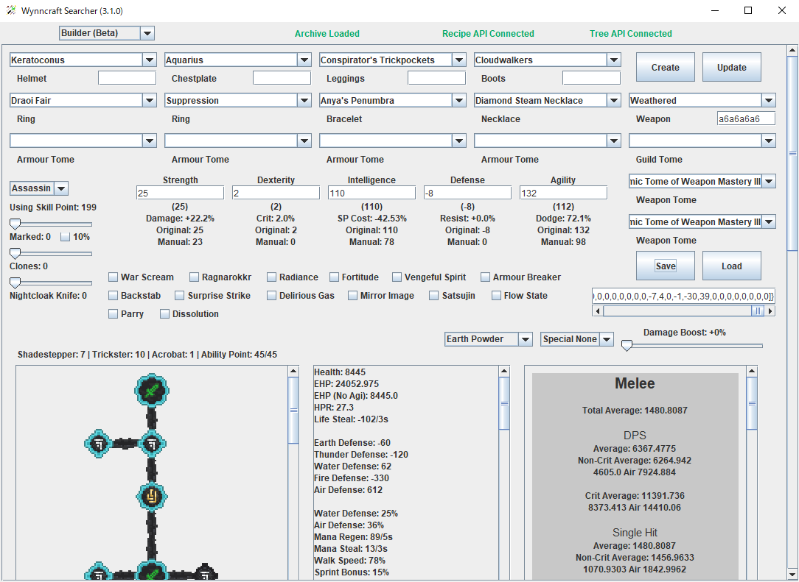
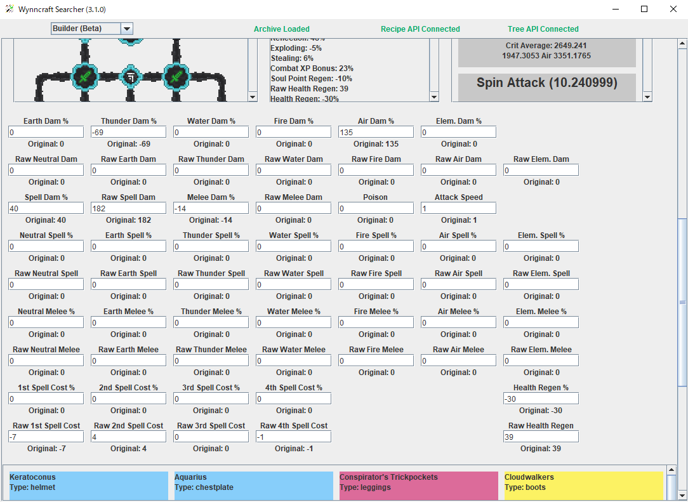
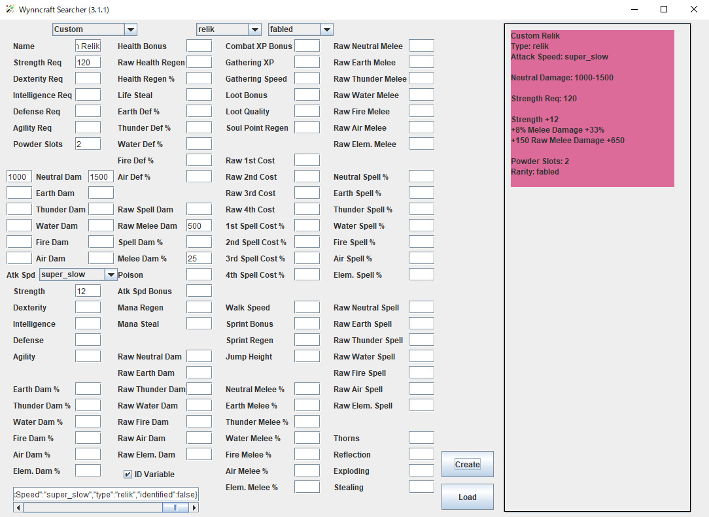
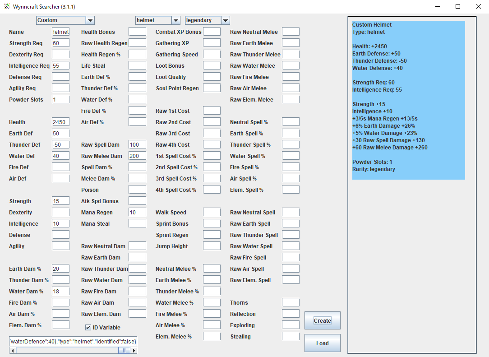
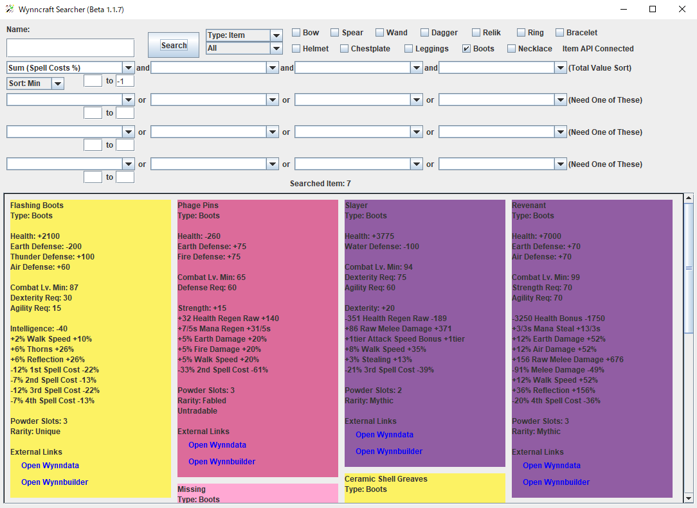
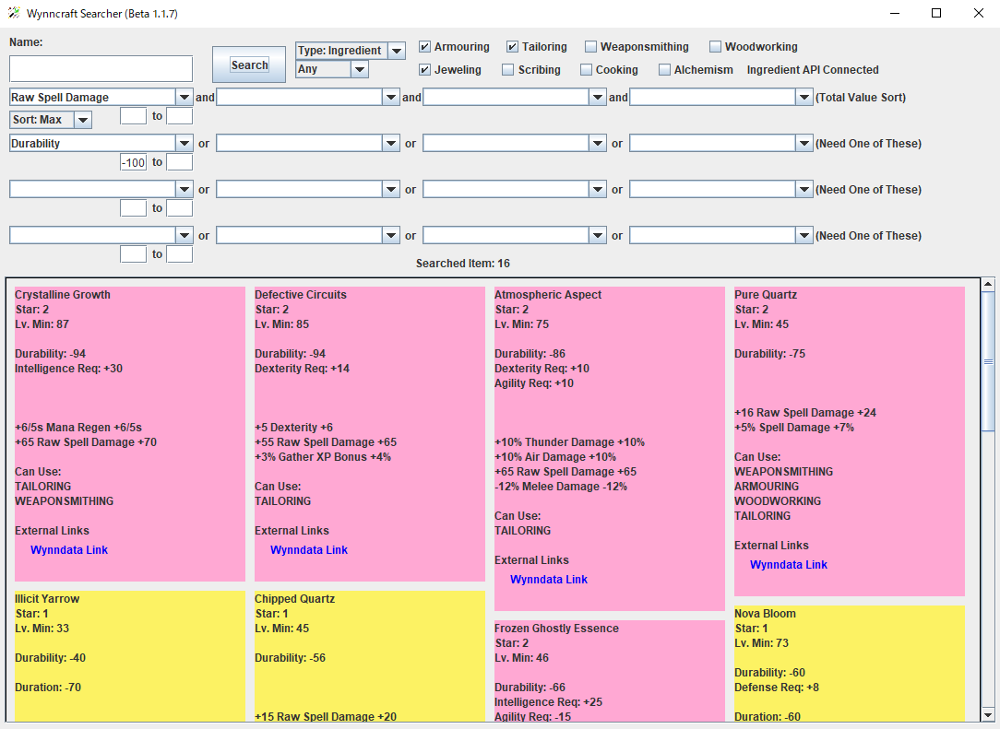
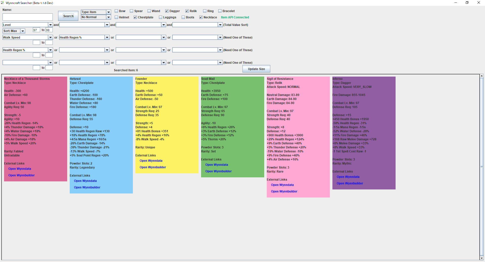
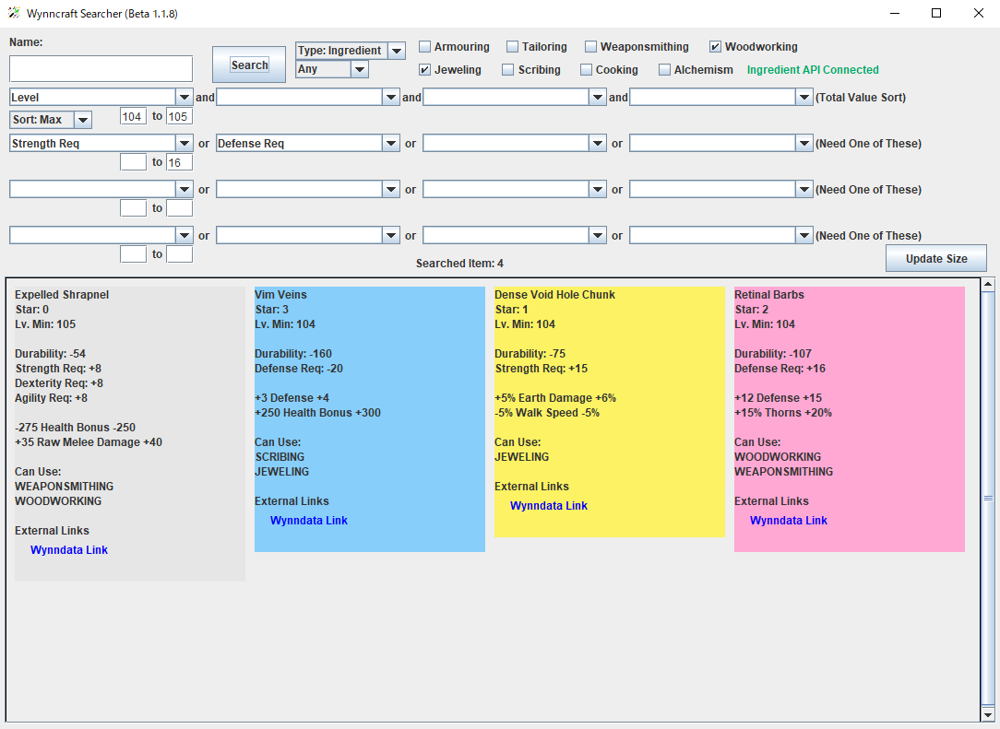

# WynnSearcher
簡単かつ詳細にWynncraftのアイテムが検索できます  
現在日本語の説明を作成中...

## 必要
Java 8 もしくはそれ以上

## 使い方
### Searcher

入手方法の精度  
種類 | 精度(完全性) | 重要度
アイテム | 90%以上(現: 708件) | 最高  
特定モブドロップ: 約111件  
The Qira Hive: 約48件  
その他 約550件 (内 商人 500件+)  

Ingredient | 不完全(不明) | 高  
全ての戦利品箱: 437件  
商人: 32件  
その他: 不明  

その他 | ✓ | 低  
ツール 48件  
マテリアル 288件  

アイテムの入手方法に対する精度  
アイテム: 80%以上の精度 (要追記: モブドロップ, 商人)  
Ingredient: 40%未満の精度 (要追記: 全ての戦利品箱, 商人)  
その他: 約20%の精度 (要追記: Tool, Material)  

アイテム: 内90%が不明な入手方法による精度不足  
Ingredient: 内88%が戦利品箱から入手できるアイテムの表記不足による精度不足  
その他: 内100%が不明な入手方法による精度不足  

### Builder (Beta)

### Crafter (Beta)

### Custom (Beta)

## Screenshots

